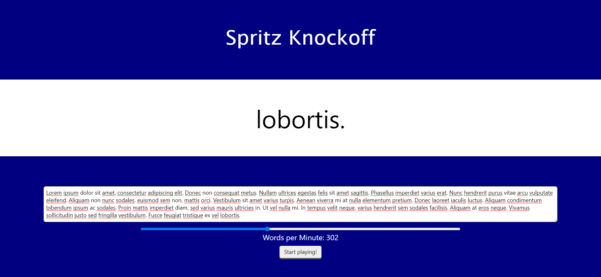

# Spritz Knockoff

A basic clone of the [Spritz](https://spritz.com) speed-reading website. Their claim is that it is easier and more efficient to read text in a single location on a page. I'll let you be the judge of that.

Simply open `main.html`, put some text into the textbox, and click the button.
The slider changes the speed of the text, ranging from slow to blazing-fast speeds.
You may change the speed as text is running or restart before a piece of text is finished, if you wish.

If you are capable of reading at speeds higher than 720 WPM, simply edit `main.html` to increase the maximum value of the slider input and test your limits.
